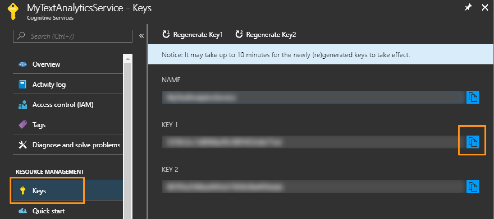
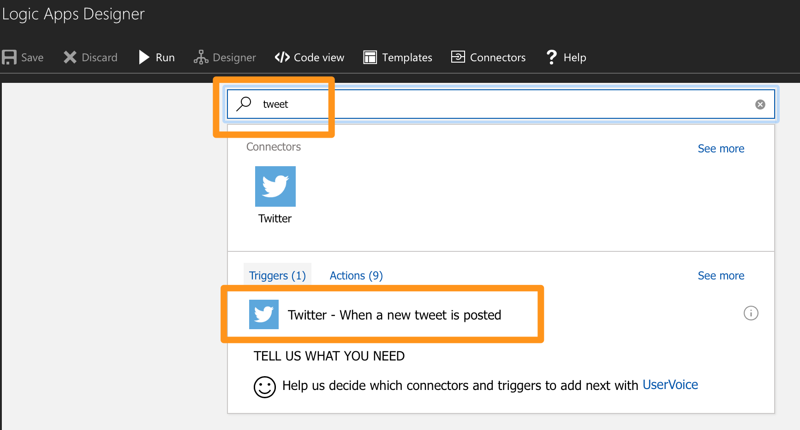
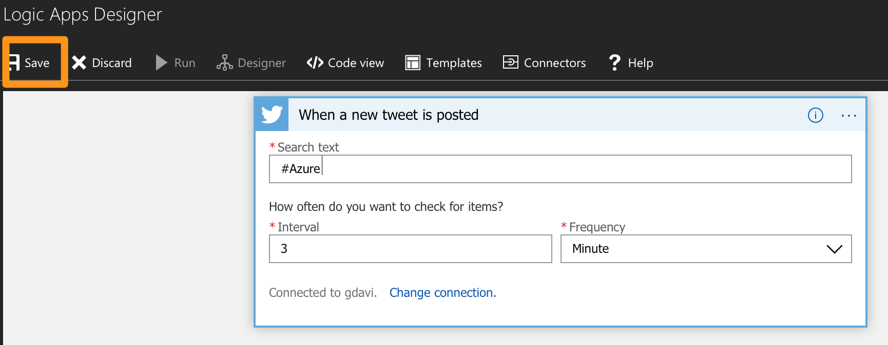

# Sentiment Logic App Lab

This lab will show you how to create a simple application in Azure without needing to do any coding. The application will:

- Watch for tweets posted with a specific hashtag.
- Determine if each tweet is positive or not.
- Send an email if the tweet meets certain conditions.

# What Azure capabilities will you use?

You will use:

- [Azure Cognitive Services](https://azure.microsoft.com/en-us/services/cognitive-services/).
- [Azure Logic Apps](https://azure.microsoft.com/en-us/services/logic-apps/)

# Getting setup to start the lab

You will need:

- An Azure subscription or an [Azure trial account](https://azure.microsoft.com/free/?WT.mc_id=A261C142F).
- A [Twitter account](https://twitter.com) to access tweets (no tweets will be posted).
- An [Outlook.com](https://outlook.com/) account for sending email. You could also choose to use Office365 or GMail.

# Overall flow

- Create a Cognitive Services account.
- Create a Logic App.
- Set a trigger for when a tweet is posted.
- Send the tweet text to Cognitive Services to analyse it's sentiment.
- Set a condition based on the sentiment results.
- Send an email if the specified conditions are met.   

# Step 1: Create the Cognitive Service
Create a Text Analytics Cognitive Service that will analyse text and determine the sentiments expressed in it.

1. Open the [Azure Portal](https://portal.azure.com).
2. Select **New** and then in the search area start typing Cognitive Services until it appears in the list:
    
3. Select **Cognitive Services** and click the **Create** button.
4. Complete the fields as shown, in particular:
    - API type: Text Analytics API 
    - Pricing tier: F0 (the free tier)
    - Pin to dashboard: ticked
   
    

5. Click **Create** and after the account is created, click on your new Cognitive Services account pinned to the dashboard.
6. In the account overview copy the **Endpoint** URL and save it for use later.

7. In the account, click **Keys**, and then copy the value of **Key 1** and save it with the endpoint URL. You use this key to connect the logic app to your Cognitive Services account:
    

# Step 2: Create the Logic App
Create a Logic App that will carry out the actions required.

1. In the [Azure Portal](https://portal.azure.com) select **New** and then in the search area start typing **Logic App** until it appears in the list:
    
2. Select **Logic App** and click the **Create** button
3. Complete the fields as shown, in particular:
    - **Name** = Any name such as MyLogicApp 
    - **Location** = choose any region listed, usually one close to you
    - **Pin to dashboard** = ticked
    
4. Click **Create** and after the account is created, click on your new Logic App pinned to the dashboard
5. In the Logic App Designer (which loads automatically), scroll down and select **Blank Logic App** template:
      
6. Stay in the designer and proceed to Step 3.  

# Step 3: Set the logic app to trigger when a tweet is posted

Trigger the Logic App when a tweet is sent matching specific criteria.

1. In the Logic App type **Tweet** into the search area and select **Twitter - When a new tweet is posted**:

2. Click **Sign in** and use your Twitter username and password to allow this Logic App to access Twitter:

3. Then enter a hashtag to search on. Use something that will have some tweets posted regularly, e.g. #Azure. Keep the timing on the default:

4. **Save** the Logic App 
 
5. Move onto Step 4.

# Step 4: Analyse the tweet using the cognitive service

Determine the sentiment of the tweet content using the Cognitive Service.

1. In the Logic App designer select **+ New step** and **Add an action**:
    
2. Start typing **Text Analytics** into the search area until it appears, then select it:
    
3. Select **Text Analytics - Detect Sentiment**:
    
4. Enter a name for the connection (it doesn't matter what but something like MyConnection) and paste in:
    - the Cognitive Services key from Step 1 above. 
    - the Endpoint URL from Step 1 above
     
5. In the **Text** field select the **Tweet Text** option in **Insert parameters from previous steps**: 
     
6. Save the Logic App and proceed to Step 5.     

# Step 5: Create a condition based on the tweet sentiment
Check what the sentiment is and act accordingly. The Text Analytics service returns a value between 0.0 and 1.0 to represent the sentiment (positive or negative expressions in the text), with the higher the score (i.e. the closer to 1 the higher the sentiment.

1. In the Logic App designer select **+ New step** and **Add a condition**:
    
2. In the condition set these values:
    - Select **Score** from the options in **Insert parameters from previous steps.** This is the value between 0 and 1 that returned as the sentiment from the Cognitive Service. 
    - **is greater than or equal to** to choose a sentiment above a certain value.
    - **0.6** enter 0.6 as the value representing a positive sentiment.
    
3. Save the Logic App and proceed to Step 6.

# Step 6: Send an email if the sentiment if positive

If the sentiment score meets the set criteria, send an email.

1. In the Logic App designer select **If true** and **Add an action** 
    (you may need to scroll in the designer if you can't see it):
    
2. Enter the text **outlook** in the search field and choose **Outlook.com**
    
    - Sign into the account.
    - Select **Outlook.com - Send an email**:
    
3. In the Send an Email action enter these values
    - **To:** The email address to send the alerts to - i.e. your email address. 
    - **Subject:** Give the email a subject e.g. Happy Tweet Alert.
    - **Body** Enter text and use parameters to compose the body of the email, like the example shown below:
       
4. Save the Logic App and proceed to Step 7.

# Step 7: Run the app

Run the app and see the results.

1. Ensure the app is running by selecting **Run** in the Logic App toolbar:
    
2. Check the email address that set in the To: field in the send email action and see if you have emails. Note that you may need to wait a few minutes.
    
3. Go to the Logic App **Overview** and select a result:
    
4. Look at each step (click to expand the step) and see what happened and what values are in each step:
       
5. If you want to go further take a look at Next Steps below and/or read Disabling the Logic App below to complete the exercise.

# Next steps
Some other ideas to try if you have time.

1. Change the hashtag to something else, perhaps your home town name?
2. Change the sentiment score value in the condition.
3. Add an action for the **If false** flow of the condition - perhaps an email again, but with different settings in the subject and body.
4. Try other actions - add the sentiment scores to a file for example.

# Disabling the Logic App
In order to stop receiving lots of email (and consuming all of the free cognitive services) disable the Logic App.

1. Go to the Logic App **Overview** and select **Disable**:
    
2. You can re-enable the app whenever you like to restart it.
